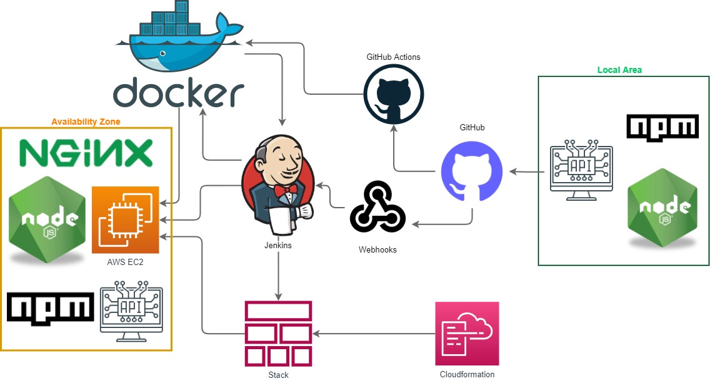

# best-cloud-academy-api



If you want to run the app locally, you can use the following commands:
`npm install`
`npm run start 
`

To run the containerized application, we need to build a Docker image first.
We defined the dependencies, requirements, and instructions in the `Dockerfile`:

```bash
FROM node:16-alpine
# Create app directory
WORKDIR /usr/src/app
# Install app dependencies
COPY package*.json ./
RUN npm install
# Copy app files 
COPY . .
# Define the port that the app will listen on
EXPOSE 3456
# Define the command that will be executed when the container is run
CMD [ "node", "index.js" ]
```

To build the Docker image you need to use the `docker build` command: 
`docker build -t devenes/weather-app:1 .
`
After you have built the Docker image, you can run it using the `docker run` command: 
`docker run -p 3456:3456 devenes/weather-app:1
`
After you have run the Docker image as a container, you can access the app using the following URL:
http://localhost:3456/

To upload the Docker image to Docker Hub, we use the `docker push` command:
`docker push devenes/weather-app:1`

Check out the [Docker Hub Profile](https://hub.docker.com/repository/docker/devenes/weather-app) to see the Docker image and the other versions of the app.

You can download the Docker image from the Docker Hub using the following command:
`docker pull devenes/weather-app:10`

To stop the container, use the `docker stop` command:
`docker stop <container_id>
`
To remove the container, use the `docker rm` command:
`docker rm <container_id>
`
To remove the image, use the `docker rmi` command:
`docker rmi <image_id>
`
To remove the image and all the containers that are based on it, use the `docker rmi -f` command:
`docker rmi -f <image_id>`

-----------------------------------------

###CI/CD with GitHub Actions

We used GitHub Actions to automate the build and deployment of our Docker image to Docker Hub.

We used this configuration in our GitHub Actions workflow to start the build and push when a new release branch is created. 
Defined the `on` section to run the build and push when a new release branch is created. 
```bash
name: Docker Build And Push
on:
  push:
    branches:
      - "release"
```      


Wrote the stages to build Docker image and login to Docker Hub.
To login to Docker Hub you need to define your Docker Hub credentials in the environment variables on GitHub which are called `DOCKER_HUB_USERNAME` and `DOCKER_HUB_PASSWORD`.
```bash
jobs:
  docker:
    steps:    
      - name: Set up Docker Buildx
        uses: docker/setup-buildx-action@v1
      - name: Login to DockerHub
        uses: docker/login-action@v1
        with:
          username: ${{ secrets.DOCKERHUB_USERNAME }}
          password: ${{ secrets.DOCKERHUB_TOKEN }}
```          


One of the best practices is to use the `run_number` variable on GitHub workflow to name the Docker image tag and avoid overwriting images and define new versions.
```bash
      - name: Build and push
        uses: docker/build-push-action@v2
        with:
          push: true
          # use the latest tag from the release branch with run_number
          tags: devenes/weather-app:${{github.run_number}}
```  
-----------------------------------------
##CI/CD with Jenkins using Webhooks
An alternative way to build and push the Docker image automatically is to use Webhooks on GitHub to trigger the build and push when a new release branch is created. You need to add a Webhook configuration on your GitHub repository settings with writing the Jenkins Webhook URL in the `Payload URL` section. 

Your `Payload URL` will appear as: `http://your-jenkins-server:8080/github-webhook/`. But you need to be sure that the plugin is installed and enabled on your Jenkins server.

Simply when you create a new branch on your GitHub repository, you can trigger the Jenkins pipeline by sending a POST request to the `Payload URL`. It means that every time you commit into a specific branch which you selected on Jenkins settings or any other branch, the Jenkins pipeline will be triggered. By defining the stages on Jenkins pipeline, you can build, push or pull the Docker image or clone your repository automatically. 


```bash
stages {
    stage('Delete old containers') {
        steps {
            sh 'docker stop $(docker ps -a -q)'
            sh 'docker rm $(docker ps -a -q)'
    }
    stage('Delete image') {
        steps {
            sh 'docker rmi $(docker images -q)'
    }

    stage('Delete old images') {
        steps {
            sh 'docker rmi -f $(docker images -q --filter "dangling=true")'
        }
    }
    stage('Delete old containers') {
        steps {
            sh 'docker rm $(docker ps -a -q)'
        }
    }
    stage('Delete old directories') {
        steps {
            sh 'rm -rf /usr/src/app/node_modules'
            sh 'rm -rf /usr/src/app/package-lock.json'
        }
    }
    stage('Delete old best-cloud-academy-api') {
        steps {
            sh 'rm -rf /usr/src/app/best-cloud-academy-api'
        }
    }
    stage('Clone and build image') {
        steps {
            sh 'git clone https://github.com/devenes/best-cloud-academy-api.git' 
            sh 'cd best-cloud-academy-api && docker build -t devenes/weather-app:latest .'
    }
    stage('Pull image') {
        steps {
            sh 'docker pull devenes/weather-app:latest'        
    }
    stage('Start container') {
        steps {
            sh 'docker run --name best-cloud -d -p 3456:3456 devenes/weather-app:latest'
    }
}
```  

------------------------------------------------------

The way we chose to implement Jenkins into the CI/CD pipeline is to use Cloudformation to create a Stack and deploy it to AWS. The reason we use Cloudformation is to automatically configure and install a server like Nginx and also tools like Git, Docker, and Jenkins. 

Use "jenkins-server.yml" file to create a Cloudformation Stack on AWS. 

------------------------------------------------------
##Reverse Proxy with Nginx

After running Docker container, we need to configure the app to be available on the Internet. But we will not be configuring the app to be available on the Internet. We will be editing the Nginx configuration file to use a reverse proxy to forward requests to the port which is Nginx listening on.

In the first step, we need to create a new Nginx server and configure it. The earlier we configure the Nginx server, the faster the app will be available on the Internet. So the fastest way to configure the Nginx server is using Cloudformation Stack so that we can edit the Nginx configuration file in the Cloudformation template. The first port we defined is 3456 on the app and Dockerfile when we built and we need to forward to make the app available on the Internet via HTTP protocol by listening on port 80. 

We added the following commands to the Cloudformation template under the `UserData` section:

```bash
          # install nginx
          amazon-linux-extras install nginx1.12
          # start nginx
          systemctl start nginx
          # enable reverse proxy in nginx.conf with adding the following line
          sed -i '48i proxy_pass http://localhost:3456/;' etc/nginx/nginx.conf
```  

The last view of the Nginx configuration file is:
```bash
    server {
        # listen on port 80
        listen       80 default_server;
        listen       [::]:80 default_server;
        server_name  _;
        root         /usr/share/nginx/html;

        # Load configuration files for the default server block.
        include /etc/nginx/default.d/*.conf;

        location / {
        # the port which is our app working on    
        proxy_pass http://localhost:3456/;
        }
```          

And also if we want to see the result of the app on the Internet, we can add Docker commands to the Cloudformation template under the `UserData` section:
```bash
          docker pull devenes/weather-app:10
          docker run -d -p 3456:3456 --name enes-10  devenes/weather-app:10
```

At the end of the Cloudformation template, we need to add the following commands to the `UserData` section for restarting the Nginx server to be able to see the result of the app on the Internet:
```bash
          systemctl restart nginx.service
```


